# Draft Day

A real-time web app for running a **sealed-bid auction + snake** fantasy football draft. Every manager nominates, bids and picks from their own phone or laptop; sealed bids flip at the same moment on every screen when a server-controlled clock runs out; and the app handles ties, budgets, rosters, position limits, broke teams and the switch to the snake on its own. A TV-sized big board shows the room what's happening.

The goal is to cut a 6–8 hour whiteboard draft to about 3 hours without changing how the league plays.

> **Status:** phases 1–3 of the build plan are done (rules engine, server, all draft-day and pre-draft screens), with two full-length 12-team scripted mock drafts completing cleanly against the live server. Since then: email sign-in (code + link), a private ranked queue, sounds and vibration, the full commissioner console (budget/roster edits, void lot, injuries), a build-up reveal show (with a TV version for the big board), a server CSV export, and player photos and bye weeks. A second manual mock draft (the commissioner plus 11 bots, with a real 2026 NFL player pool) finished cleanly. Still to come: hosting, a real mock draft with the league on phones, and MyFantasyLeague import/export. See [What's not built yet](#whats-not-built-yet).

**Contents**

- [How a draft works](#how-a-draft-works)
- [Walkthrough of the app](#walkthrough-of-the-app)
- [League settings](#league-settings)
- [How it works under the hood](#how-it-works-under-the-hood)
- [Tech stack](#tech-stack)
- [Repository layout](#repository-layout)
- [Getting started](#getting-started)
- [Testing](#testing)
- [API reference](#api-reference)
- [Data model](#data-model)
- [What's not built yet](#whats-not-built-yet)
- [Project documents](#project-documents)

---

## How a draft works

The draft runs in two phases. Every number below is a league setting; the defaults are the league's own rules.

### Phase 1 — Sealed-bid auction (first 8 roster spots)

1. **Nominations.** Teams nominate one available player each, in draft order. Nomination order *snakes* across rounds (1 → 12, then 12 → 1, …). A team that has filled its 8 auction spots, or is **broke** (can't afford the $5 minimum bid), is skipped.
2. **Bidding, one lot at a time.** Once a round's nominations are in, each nominated player ("lot") is bid on in nomination order. Every eligible team may submit **one sealed bid** — at least the minimum, within its remaining budget, not past a position limit — and can change it until the clock ends. Or it can **Pass**: that locks the team in without bidding (so the lot can close sooner), can be changed to a bid until the clock ends, and looks exactly like a bid to everyone else.
3. **Early close.** When every eligible team has bid or passed, there's a 3-second "last call" and bidding closes.
4. **Reveal.** Every screen plays the same short reveal at the same moment — sealed cards and a drumroll, runner-up bids flipping lowest first, then the winner — showing the winner plus as many runner-up bids as the league's reveal setting allows (default: top 3). Other bids stay hidden forever; passes are shown only as a count ("2 teams passed"), never who. The reveal takes about 18 seconds (it ends with a 10-second "Up next" countdown), and the next lot's clock doesn't start until it's over.
5. **Ties.** Only the teams tied for the top bid re-bid, each raising its own bid by at least the tie raise ($5). Every re-bid amount is revealed after each round; teams still tied continue until one wins. A tied team that can't raise (all-in) keeps its bid; if every tied team is all-in, the tie fallback decides (default: random draw, done by the server and logged). If a tied team doesn't re-bid in time, its previous bid stands.
6. **No bids.** If nobody bids (everyone passed or let the clock run), the nominator gets the player at the minimum — or the player goes back in the pool if the nominator is full or at a position max (or if the league chose "always return to pool").
7. The auction repeats round after round until every team has filled its auction spots or is broke.

### Phase 2 — Snake draft (the rest of the roster)

1. Order runs 1 → 12, then 12 → 1, and so on (the turn-around teams pick twice in a row).
2. Every team makes its regular snake picks for its non-auction spots (17 − 8 = 9 rounds by default).
3. **Broke-team make-up rounds.** A team that went broke before filling its auction spots still makes all its snake picks, then fills its missing auction spots in extra *make-up rounds* after the snake, in snake order among just those teams.
4. Picks can never break position limits or leave a roster unable to meet its position minimums. If the pick clock runs out, the app auto-picks the first player in the team's queue that fits, else the best available that does (or skips the team, per the league setting).
5. The draft ends when every roster is full, and everyone sees the results.

### Ground rules the app enforces

- **The server decides everything.** Clients send intents ("I bid $47"); only the server judges validity, keeps time, and resolves lots. A bid counts if the server received it before the clock ended — phone clocks don't matter.
- **Bid amounts never leave the server before the reveal** — not to other managers, not to the commissioner, not in any log sent to a client. After the reveal, only the amounts the reveal showed are ever sent.
- **Nobody acts for anyone else.** The commissioner can pause, undo, resolve a tie fallback, void a lot, and fix budgets and rosters (every change announced to everyone), but can never nominate, bid or pick for a team.
- **Every change is saved before it's broadcast**, so a server restart loses nothing.

---

## Walkthrough of the app

All screens use the "stadium at night" dark theme (dark green, chalk white, scoreboard amber) and work on phones (from 360 px wide), laptops, and a TV. The screenshots are from a demo draft with the league's default settings and made-up players.

### 1. Sign in (`/login`) and Home (`/`)

Enter your email and we send a 6-digit code and a sign-in link — no password. Type the code (handy on a phone, where a link can open in a different browser) or tap the link. The first time, you pick the name the league sees. You stay signed in on that device for 90 days, then you're sent back to wherever you were headed. (With `DEV_LOGIN=true` on the server, a "Developer login" that skips the email is also offered, for local testing only.)

Home lists your leagues — which you run, which team is yours, and each league's status ("Setting up · 7 of 12 teams claimed", "Draft is live", "Draft complete"). From here: **Create a league**, or join one by typing an invite code.

<p>
  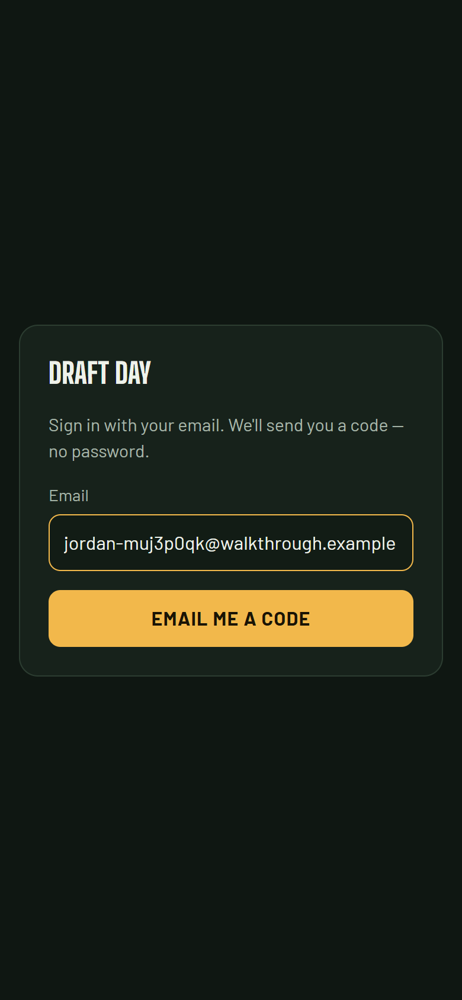
  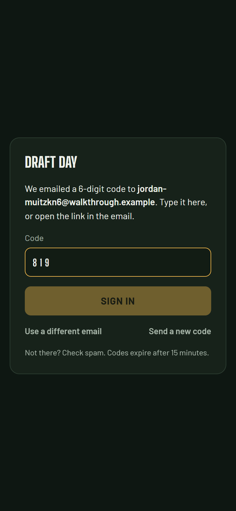
  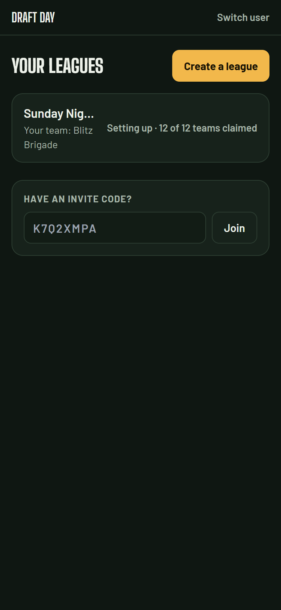
</p>

### 2. League setup (`/league/new`)

The commissioner's settings form, with the league's usual rules filled in:

- Teams & roster: team count, roster size, auction spots, position limits (groups like "WR/TE 6–7", or off).
- Money: budget, minimum bid, bid step, minimum tie raise.
- Clocks: nomination, bid, tie re-bid and snake pick (each can be off).
- Auction rules: nomination order, no-bid rule, tie re-bid round limit, tie fallback, bids shown at reveal, early close, broke-team make-up rounds.
- Snake: what happens when the pick clock runs out.

A **"Rules at a glance"** panel reads the settings back as plain sentences ("12 teams with $1,000 each buy 8 players at sealed-bid auction, then snake-draft 9 more…"). Problems are listed as you type, using the same validator the server runs, so the form and server can't disagree.

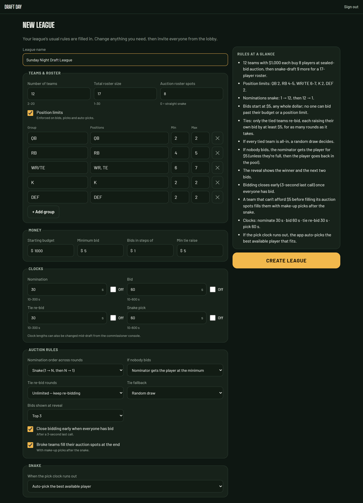

### 3. Lobby (`/league/:id`)

The league's waiting room, refreshed every few seconds for everyone:

- **Invite link** (`/join/CODE`) with a copy button; the commissioner can replace it (the old one stops working).
- **Teams & draft order** — who has claimed which slot. Managers rename their own team. The commissioner can move teams up/down, **shuffle** the order (done on the server so it can't be rigged), rename any team, or remove a manager from a slot.
- **Player pool** — upload a **CSV** (a MyFantasyLeague player export saved as CSV works: "Last, First" names and PK/Def positions are converted; an optional **Photo** column of `https://` image links adds headshots), preview it before adding, add single players, browse and remove. The pool must have at least *teams × roster size* players before the draft can start.
- **My queue** — every manager can search the pool and rank the players they want before the draft (private to them; it carries into the draft).
- **Rules** summary, with an Edit settings link for the commissioner. Once the draft has started the rules are locked, but the league can still be renamed.
- **Start the draft** (commissioner). If some teams have no manager, it says exactly what will happen to them (auto-nominated / auto-picked when their clocks run out — or that a clock set to off would stall the draft). Starting locks settings, teams, order and pool.

Everyone watching the lobby is moved into the draft automatically when it starts.

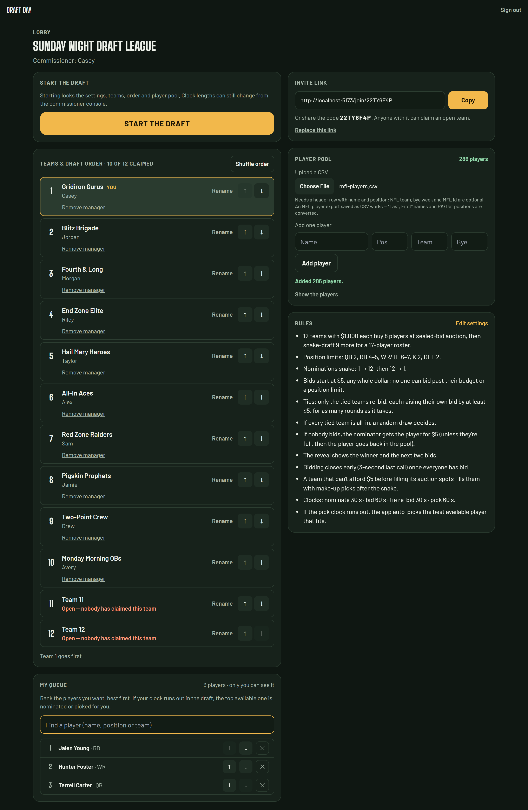

### 4. Join (`/join/:code`)

Open the invite link, sign in if needed, pick an open team, give it a name. Two people can't grab the same team — one wins, the other is asked to pick again.

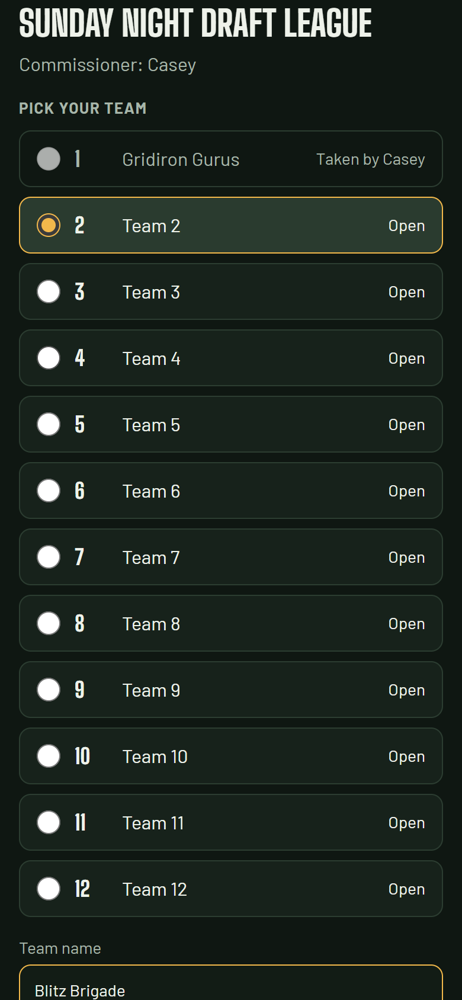

### 5. Draft screen (`/draft/:id`)

One screen that shows whatever is happening right now.

**Nominate.** When it's your turn: "You're on the clock" with the nomination clock. Right under it, **Nominated this round** lists every player put up so far and by whom, who's nominating now and who's next — so you can see what's taken before you search. Then player search and position filters. Searching for someone who can't be nominated shows the player greyed with the reason ("Already nominated this round — Lot 1, by Team 1", "Already drafted by Team 2 ($96)"). A ☆ on every row adds the player to your private **queue**, and the "★ My queue" filter shows just your queued players in your order — if your nomination clock runs out, the top one is nominated for you. Everyone else sees "Team 4 is nominating…" and the same list.

<p>
  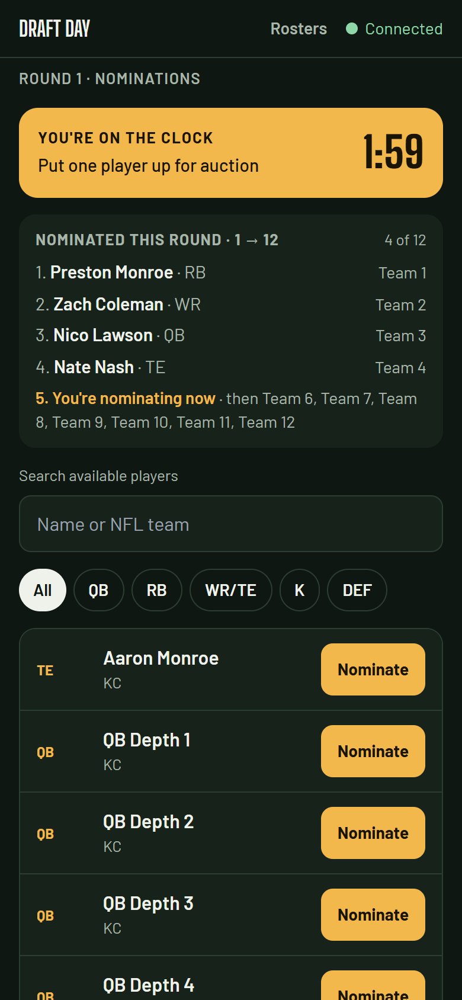
  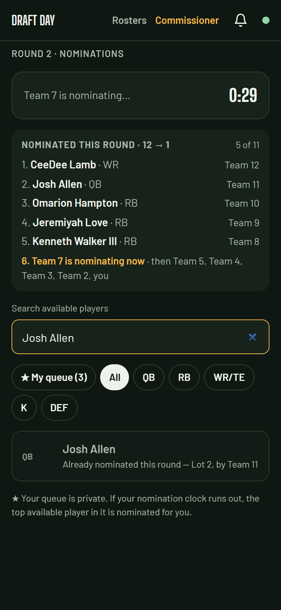
</p>

**Bid.** The player card — photo, then position · NFL team · bye week above the name — with a countdown ring; your budget, auction spots and count at this position; an amount entry (keypad on phones, a typed field + Enter on laptops); **Lock in sealed bid** and **Pass**. After locking in: "Your bid is in and hidden" (or "You passed") with **Change bid / pass**. A strip shows "N of M are in" — one tile per team, never amounts, bids and passes identical. If you can't bid (full, broke, at a position max) the controls say why.

<p>
  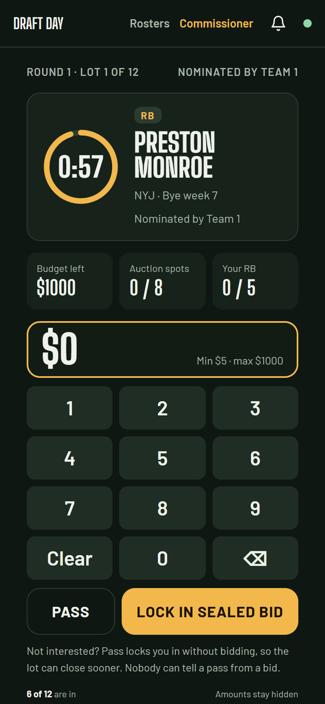
  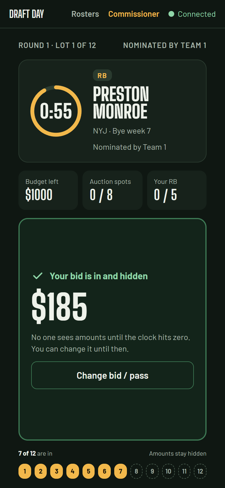
  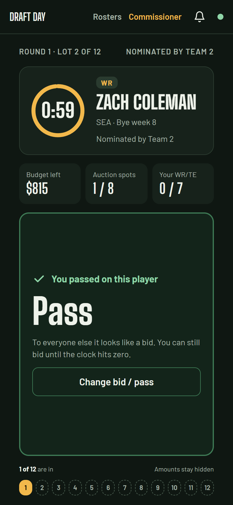
</p>

The laptop layout adds this round's lots on the left and every team's max bid / spots / position count on the right.

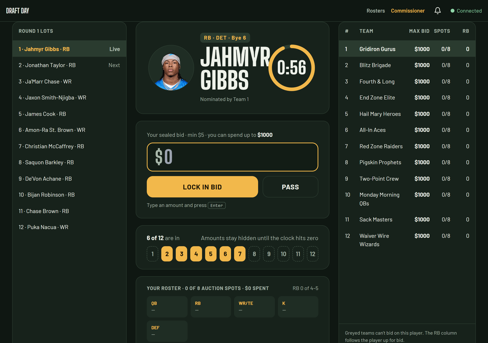

**Reveal.** When bidding closes, every screen plays the same show (timings with the default top-3 reveal):

1. **Bidding closed** — one face-down card per team that bid or passed (they look the same), shaking to a drumroll that speeds up (0–2.4 s).
2. The runner-up bids the reveal setting allows flip one at a time, **lowest first**, each with a thud — 3rd at 2.4 s, 2nd at 3.9 s.
3. **"And the winner is…"** (5.4 s)
4. At 6.4 s the winner's card slams down with the price counting up, then "won by $15" and confetti. On the winner's own phone: a full-screen **"You won!"** and a long buzz.
5. Bids that stay hidden turn into padlocks ("1 bid stays sealed · 2 passed"), and the winner's budget before → after and "Up next · clock starts in" appear at 7.8 s, followed by a full 10-second "Up next" countdown; the next lot's clock starts at 17.8 s. The winner stays up for the whole 11.4 s. With fewer bids shown the show is shorter (winner only: 14.8 s), with more it's longer (all bids: 19.8 s) — the countdown is always 10 s.

The next lot's clock waits until the reveal is over, so nobody loses bidding time watching it. Sounds and vibration follow each person's settings; the big board plays the same show silently.

<p>
  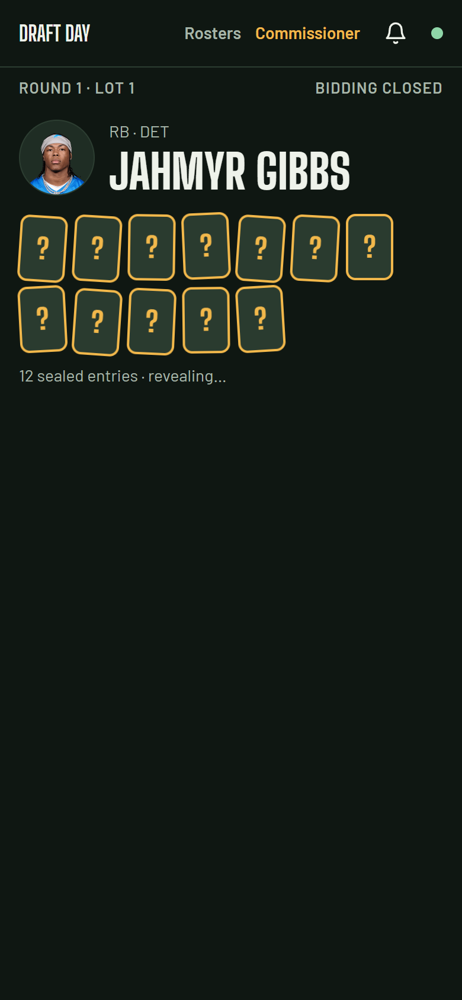
  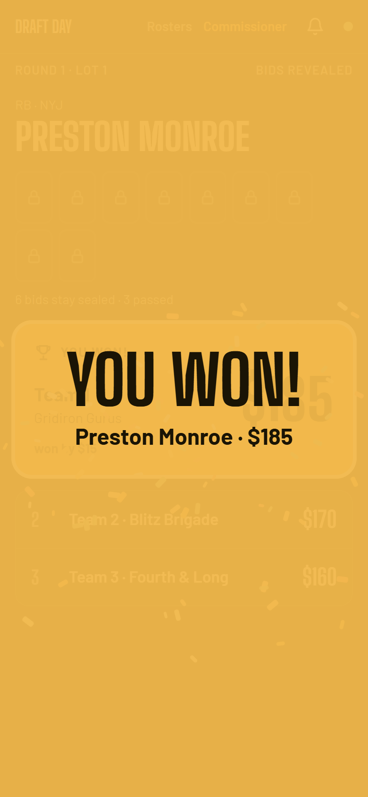
  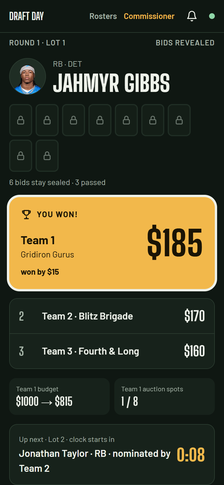
</p>

**Ties.** A tie ends the show with **"It's a tie!"** and the tied teams. Then the tied teams get "You're still tied" with the tie clock, the history of re-bid rounds (knocked-out teams struck through), −/+ $5 steppers and quick-raise buttons, and the minimum allowed; everyone else sees "Tie-break in progress".

<p>
  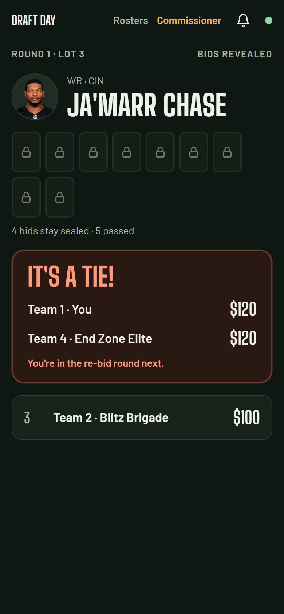
  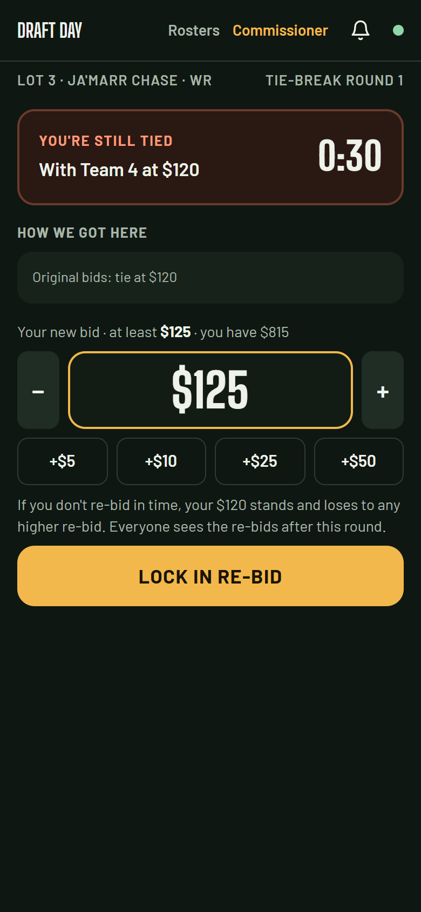
</p>

**Snake and make-up picks.** The on-the-clock banner with who's next, "You still need" position chips, available players (greyed with the reason if a pick would break your limits, ☆ to queue them), a **My queue** tab (your ranked list, ↑ ↓ ✕ to reorder, Draft straight from it; players who get taken drop off; if your clock runs out you get the first one who fits), and a Board tab with the rounds × teams grid. In make-up rounds, broke teams get "Your make-up pick" with an explanation; everyone else sees "Your roster is full", and the board adds make-up rows (M1, M2…).

<p>
  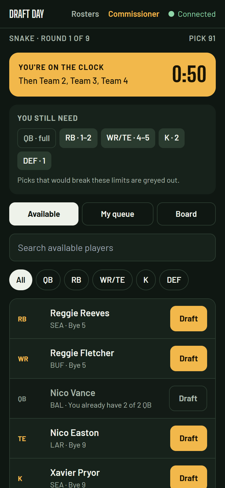
  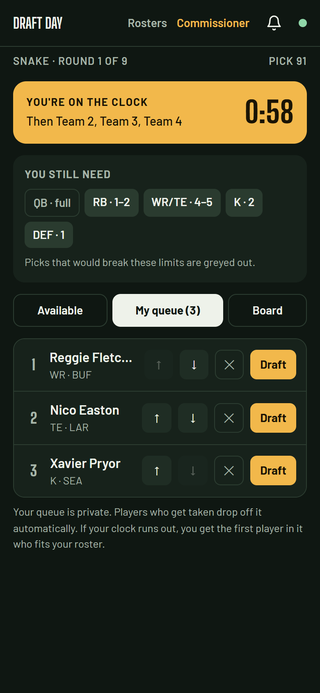
  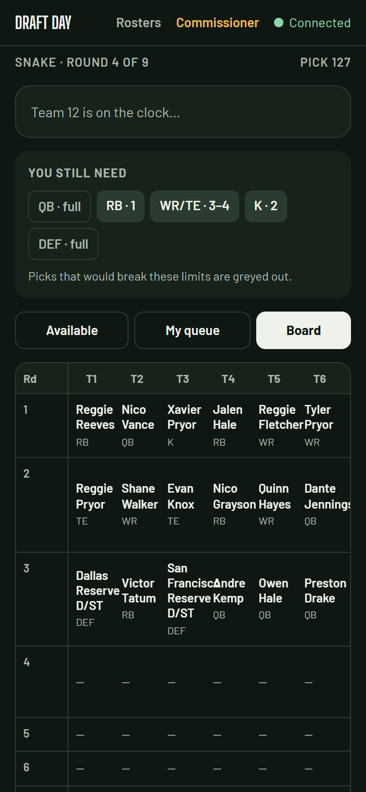
  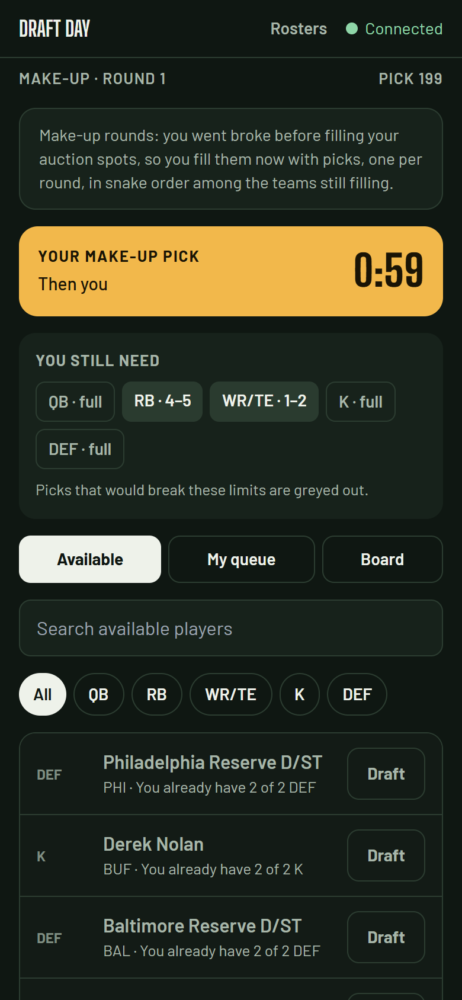
</p>

Every screen handles **paused / on break** (banner, inputs locked, clocks frozen), the 10-second **"Back in…"** countdown after the commissioner resumes (clocks hold until it ends), **reconnecting** (inputs locked until state is back), and the **last 10 seconds** (clock turns orange).

**Sounds and vibration.** A rising chime and a buzz when it becomes your turn to nominate, re-bid or pick; three ticks at 10 seconds left if you still haven't acted (bids included); the reveal's drumroll and win sounds. The bell in the header turns sound and vibration on or off for that device (iPhones don't support vibration). **Commissioner changes** — a voided lot, an injury, a budget or roster fix — show as a notice on every screen for a few seconds.

<p>
  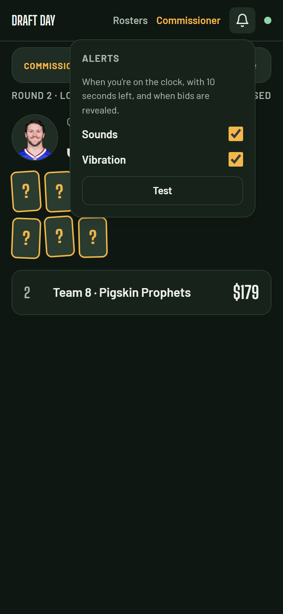
  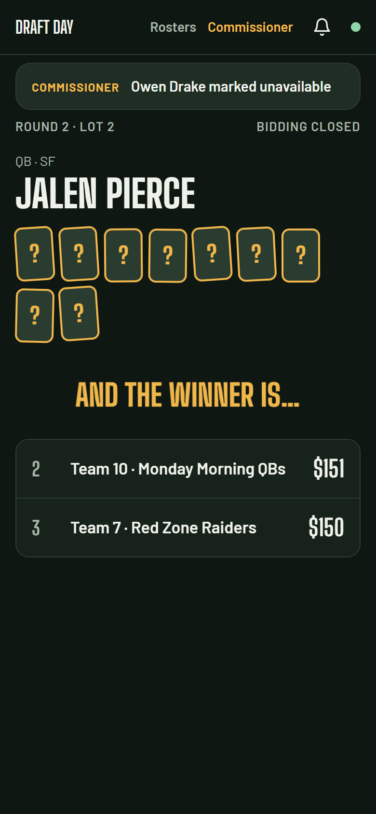
</p>

### 6. Rosters & budgets (`/draft/:id/rosters`)

Every team's money left, max bid, auction spots left, roster count and a **broke** flag, plus any team's roster by position group with counts against limits, each player's NFL team and bye week, and how each player was acquired ("$96", "Snake R3", "Make-up R1", "Auto-pick R4").

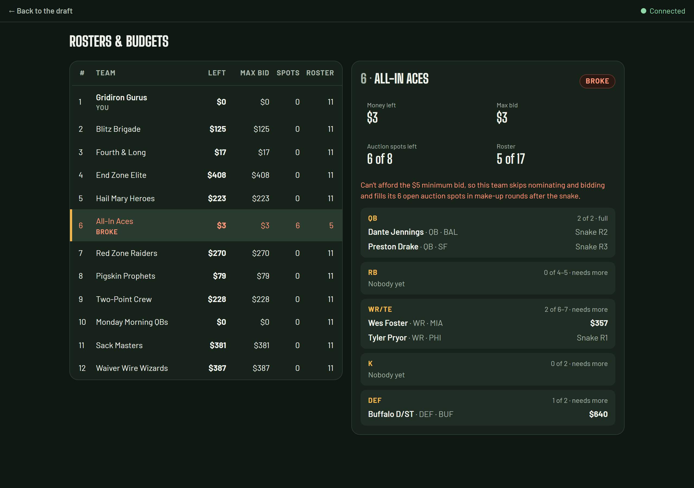

### 7. Commissioner console (`/draft/:id/commish`)

Commissioner only (a link appears in the draft header):

- Status line (phase, round, lot, clock).
- **Pause / Resume**, **+15 seconds**, **timed breaks** (5 / 10 / 15 / 30 min, countdown on every screen; the draft resumes only when you tap Resume).
- **Clock lengths** — −/+ steppers for all four clocks; changes apply from the next lot.
- **Bids shown at reveal** — winner only, top 2–5 or all bids; applies from the next reveal (lots already revealed keep what they showed).
- **Undo last result** — names exactly what it undoes ("Lot 4, Team 2 won K. Owens for $96") and asks to confirm. Undoing an award returns the money and auction spot, puts the player back in the pool, and pauses the draft.
- **Tie decision** — only when a tie reaches the fallback and the league chose "commissioner decides".
- **Injuries & voiding a lot** — void the lot being bid on (or in a tie re-bid): nobody gets the player and no bid is revealed; "Void & mark injured" also takes the player out of the pool. Mark any player unavailable, or available again.
- **Edit rosters & budgets** — pick a team; add or take away money with a reason (never below $0); remove a player (back to the pool, price refunded); add an available player into a spot the team has open (an auction spot at a price, or a snake spot freed by a removal). Adding never pushes a roster past its size or a position limit; roster edits wait out the make-up round.
- **Who's connected** — a tile per team; offline teams are marked, with a count.
- **Your changes** — every commissioner edit with its time; they're also announced on every screen and listed on the results screen.

Resume starts a 10-second "Back in…" countdown on every screen before the clock picks up again.

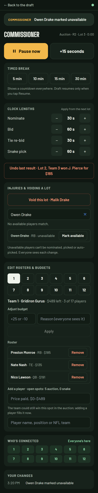

### 8. Big board (`/board/:id`)

A read-only 16:9 view for a TV or projector — no login needed. During nominations it shows a tile per team in nomination order (the player each has put up, the team on the clock with its countdown, the teams still to come). During bidding: the live lot (player photo, position · team · bye, name) with a very large clock, the "who's in" strip, this round's lots (sold / bidding now / up next), and every team's money and spots (broke teams flagged). It also plays the reveal show (without sound), shows tie-breaks, break countdowns, commissioner notices, the snake and make-up board, and finally the results. Because it needs no login, **the big board link doubles as the shareable results page**.

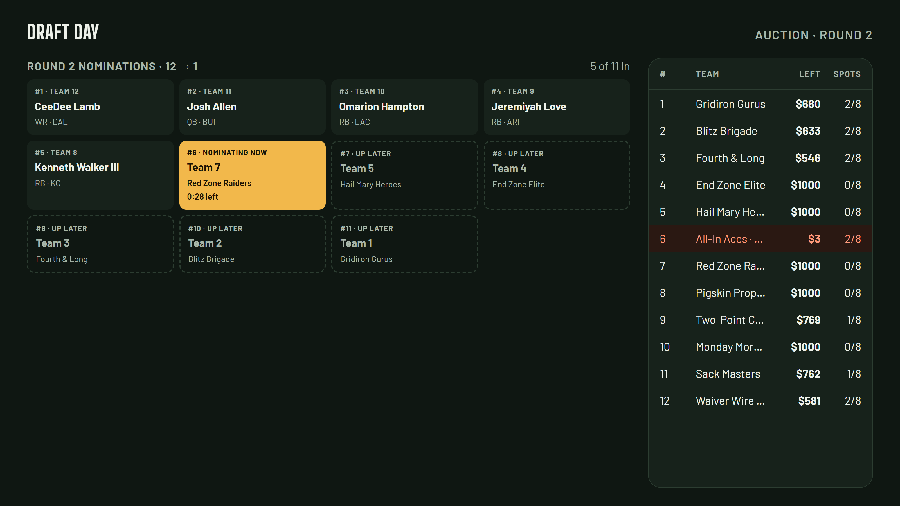

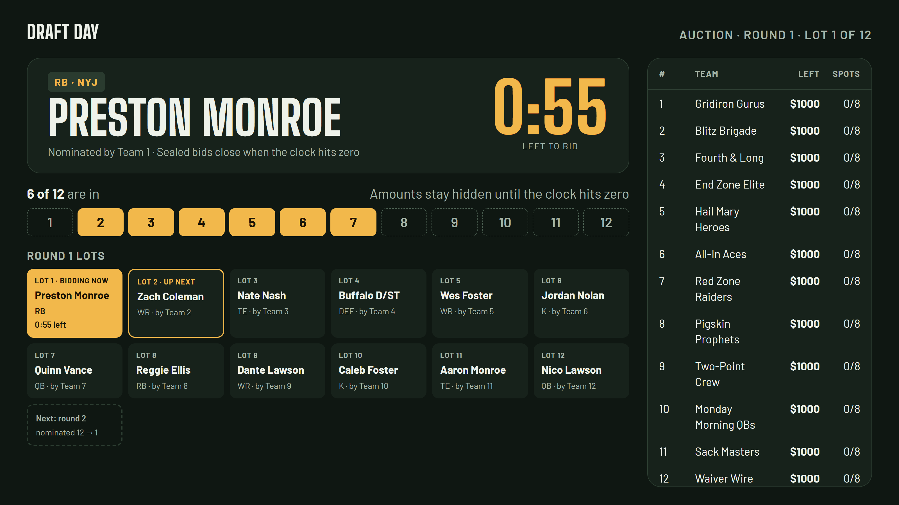

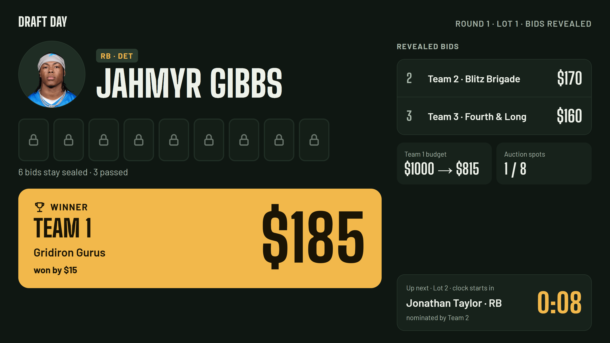

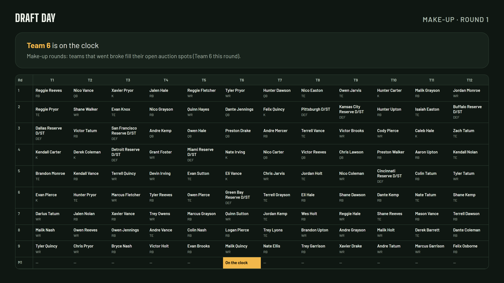

### 9. Results (end of draft)

On the draft screen and the big board:

- **Rosters & spend** — every team's final roster, money spent and left.
- **Draft log** — every pick in order with price, stage ("Auction R3", "Snake R2", "Make-up R1"), notes (tie-break, auto-pick, no bids) and the runner-up bids that were revealed. Bids that were never revealed stay secret, even now.
- **Commissioner changes** — every edit the commissioner made, in order.
- **Download CSV** — one row per pick, with the runner-up bids that were revealed (never a hidden one), served by the server so everyone gets the same file. League members only.

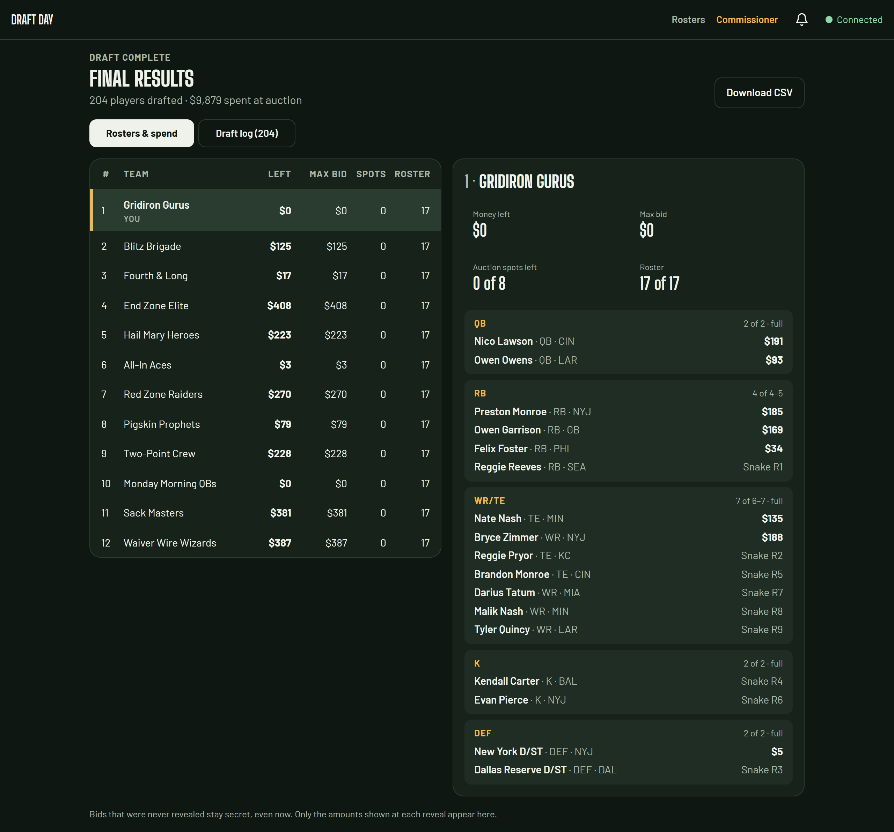

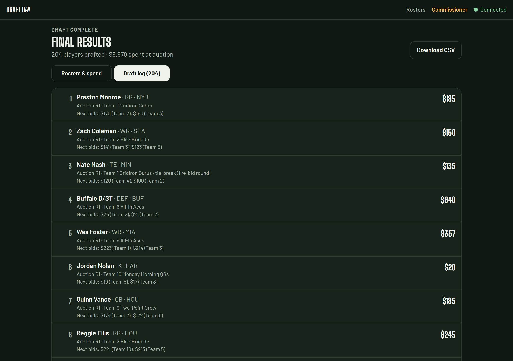

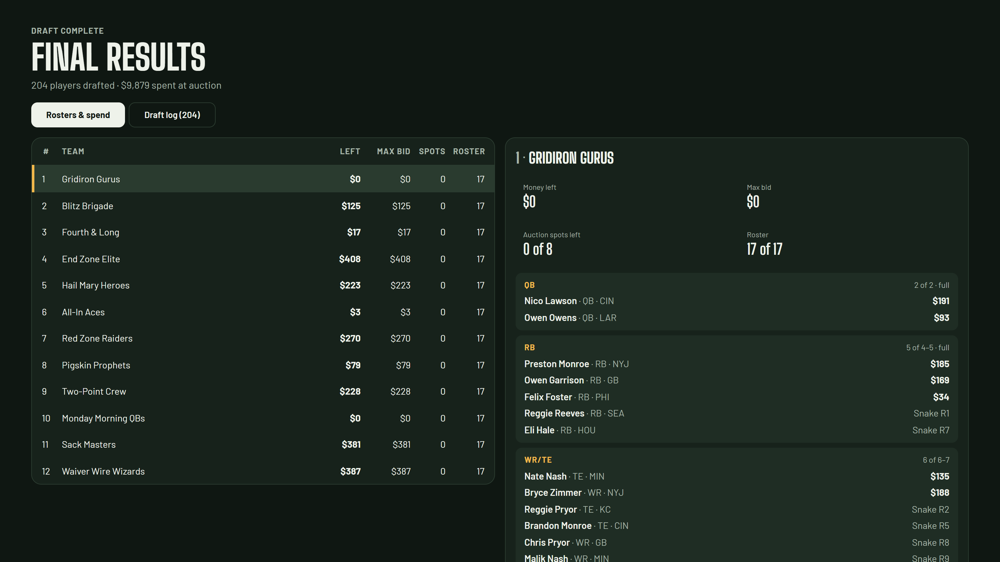

---

## League settings

Defaults live in one file: [`packages/engine/src/settings/defaults.ts`](packages/engine/src/settings/defaults.ts). Allowed ranges are enforced by [`validateSettings`](packages/engine/src/settings/validate.ts) on create and edit.

| Setting | Default | Allowed |
| --- | --- | --- |
| Number of teams | 12 | 2–20 |
| Starting budget | $1,000 | $1–$100,000 |
| Auction roster spots | 8 | 0 (straight snake) to roster size |
| Total roster size | 17 | 1–30 |
| Position limits | QB 2, RB 4–5, WR/TE 6–7, K 2, DEF 2 | any groups with min/max, or off (minimums must fit the roster) |
| Minimum bid | $5 | ≥ $0 |
| Bid step | $1 (any whole dollar) | ≥ $1 |
| Minimum tie raise | $5 | ≥ $1 |
| If nobody bids | nominator gets the player at the minimum | or always return to pool |
| Nomination order | snake (1 → 12, 12 → 1) | or the same order every round |
| Nomination clock | 30 s | off, 10–300 s |
| Bid clock | 60 s | off, 10–600 s |
| Tie re-bid clock | 30 s | off, 10–300 s |
| Snake pick clock | 60 s | off, 10–600 s |
| Close bidding early when everyone is in | on | on / off |
| Tie re-bid rounds | unlimited | unlimited or 1–10 |
| Tie fallback | random draw | random draw, commissioner decides, higher remaining budget, earlier team number |
| Bids shown at reveal | top 3 | winner only, top N, or all |
| When the pick clock runs out | auto-pick best available that fits | or skip (the team picks later) |
| Broke teams fill auction spots at the end | on | on / off |

Clock lengths and the reveal setting can be changed mid-draft from the commissioner console; everything else locks when the draft starts.

---

## How it works under the hood

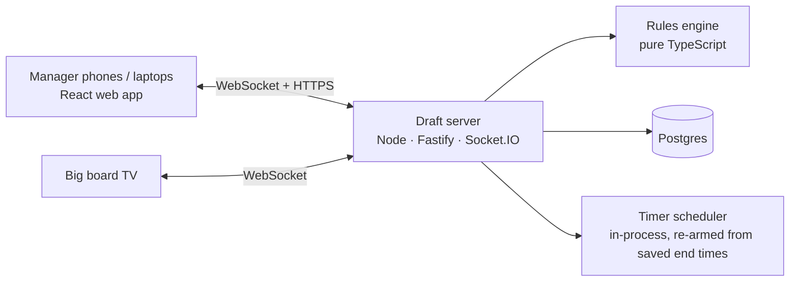
```mermaid
flowchart LR
    P[Manager phones / laptops<br/>React web app] <-- WebSocket + HTTPS --> S[Draft server<br/>Node · Fastify · Socket.IO]
    B[Big board TV] <-- WebSocket --> S
    S --> E[Rules engine<br/>pure TypeScript]
    S --> D[(Postgres)]
    S --> T[Timer scheduler<br/>in-process, re-armed from saved end times]
```

### A pure rules engine

Every rule lives in `packages/engine` as a pure function: `reduce(state, action, ctx) → { state, events }`. It never reads the clock, never uses randomness directly, and never does I/O — the current time and a random-number source are passed in (`ctx`). That makes every rule unit-testable and a whole draft replayable from its action log. The server, the web app's eligibility greying and the settings form all reuse the engine's own selectors (budgets, eligibility, position limits, turn order), so the rules exist in exactly one place.

### One authoritative server

1. A client sends an intent over Socket.IO (`bid:submit`, `nominate`, `admin:pause`, …).
2. The server checks who's asking (a manager can only act for their own team; admin intents need the commissioner) and validates the payload.
3. The intent runs through the engine under a **per-draft lock**, so actions for one draft are applied strictly one at a time. The server stamps each intent with the time it *arrived*, so a bid sent just before the buzzer counts even if it's processed a moment later.
4. The change is **saved to Postgres first**, then broadcast to everyone in the draft's room, then the draft's clock is re-armed.

**Clocks.** The server stores an absolute end time for whatever is live (nomination, lot, tie round, pick) and schedules its own expiry. After a reveal or a Resume, the next clock's end time already includes the reveal (its length comes from the engine's shared show timeline) or the 10-second "back in" countdown, and clients hold their readout until it's over. Clients count down using that end time. On restart, clocks are re-armed from the saved end times; if one expired while the server was down, it's extended and everyone is notified.

**Saving.** Each action's changes (lots, bids, picks, the draft row, an audit entry) are written as **one SQL statement** — the whole diff travels as a single JSON parameter applied with data-modifying CTEs. That's atomic without a separate transaction and costs two database round trips, which matters when the database is remote (a single action is acknowledged in ~60 ms against the hosted dev database).

**Keeping clients in sync.** On connect or reconnect a client gets a full snapshot of the draft. After every event it asks for a fresh snapshot rather than reconstructing state itself, so the server stays the single source of truth. Every draft event carries the draft's version number.

**Bid secrecy.** Bid amounts are scrubbed at the snapshot boundary. Before a lot is revealed, clients only ever see "team X is in" — for a bid or a pass alike. After the reveal, the engine's `revealedBidIds` decides exactly which amounts were shown (the top N under the reveal setting recorded on that lot, every tie re-bid once its round closes) and nothing else is ever sent. Tests inspect every outgoing message for leaks.

**Presence.** The server tracks which teams have the draft open and pushes "who's connected" to the commissioner console.

**Private data.** Each manager's queue is stripped from every shared snapshot and sent only to that manager's own open tabs (`you:private`); tests check nobody else ever receives it.

**Sign-in.** Email only, no passwords: a 6-digit code and a link (15 minutes, single use, stored hashed), 90-day sessions. The big board gets a watch-only session from its link.

**Pre-draft.** The lobby isn't part of a live draft: leagues, teams, invites and the player pool are plain HTTP resources. The draft itself is created at the moment the commissioner presses Start, from the league's current settings, teams and players — after which setup is locked.

---

## Tech stack

| Layer | Technology |
| --- | --- |
| Language | TypeScript everywhere (strict mode) |
| Monorepo | pnpm workspaces |
| Rules engine | Plain TypeScript, no dependencies |
| Server | Node.js 20+, Fastify 5, Socket.IO 4, Zod for request validation |
| Database | PostgreSQL (hosted on Supabase in development), Drizzle ORM + drizzle-kit migrations, postgres.js driver |
| Web app | React 18, React Router 6, Vite 5, Tailwind CSS 3, socket.io-client |
| Fonts | Big Shoulders Display (numbers, headings), Barlow (body) |
| Tests | Vitest (engine, server integration, web helpers); headless Chrome via playwright-core for manual end-to-end checks |

---

## Repository layout

```
packages/
  engine/            Pure rules engine
    src/rules/         One file per rule area: nomination, bidding, reveal, tie, noBid,
                       award, snake, makeup, pauseResume, clockAdmin, lotAdmin, undo, …
    src/selectors/     Budget, eligibility, roster/position limits, turn order, lots, secrecy
    src/settings/      Defaults, allowed ranges, validation
    tests/             Rule tests, edge cases, invariants, a full 12-team scripted draft
apps/
  server/
    src/http/          Auth, league setup / lobby / invites / players / draft routes
    src/ws/            Socket.IO: auth, intents, presence, broadcasts
    src/engine/        Runtime: in-memory draft registry, per-draft lock, timers
    src/db/            Drizzle schema, load / persist, mappers
    drizzle/           SQL migrations
    test/              Integration tests against a real server + database
  web/
    src/routes/        One file per page (home, setup, lobby, join, draft, console, rosters, board)
    src/components/    bid, nominate, reveal, tie, snake, board, commish, rosters, results,
                       setup, lobby, primitives
    src/store/         DraftProvider: the socket connection and current snapshot
design/mockups/      HTML mockups for the draft-day screens (visual reference)
docs/screenshots/    Screenshots used in this README (from a demo draft)
SPEC.md              Product spec — the source of truth for rules
UI.md                UI spec for the draft-day screens
PROGRESS.md          Handoff notes: what's built, known gaps, what's next
CLAUDE.md            Working rules for AI-assisted development
```

---

## Getting started

### Prerequisites

- Node.js 20 or newer
- pnpm (the repo pins the version in `package.json`'s `packageManager`)
- A PostgreSQL database (any Postgres works; development uses a hosted Supabase instance)

### Set up

```bash
pnpm install

# Server configuration
cp apps/server/.env.example apps/server/.env
# then set DATABASE_URL (and optionally PORT, default 3000) in apps/server/.env
# DEV_LOGIN=true turns on the no-check developer login; without RESEND_API_KEY,
# sign-in emails are printed to the server console instead of sent.

# Build the engine (the server and web app import its compiled output)
pnpm --filter @draft-app/engine run build

# Create the database tables
pnpm --filter @draft-app/server run db:migrate
```

### Run it

In two terminals:

```bash
# 1. The server (http://localhost:3000)
pnpm --filter @draft-app/server dev

# 2. The web app (http://localhost:5173)
pnpm --filter @draft-app/web dev
```

On Windows PowerShell, `node --env-file` in the server's `dev` script may not work; run this from `apps/server` instead:

```bash
node --env-file=.env node_modules/tsx/dist/cli.mjs src/index.ts
```

Then open http://localhost:5173, sign in with any name, create a league, and open the invite link in other browsers (or private windows) to join as other managers. The web dev server proxies the API paths (`/leagues`, `/invites`, `/drafts`, `/dev`, `/socket.io`) to the server; page paths deliberately avoid those prefixes.

### Useful scripts (from the repo root)

| Command | What it does |
| --- | --- |
| `pnpm test` | Runs every test suite (engine, server, web) |
| `pnpm run build` | Builds all three packages |
| `pnpm run typecheck` | Type-checks all three packages (build the engine first after changing its types) |
| `pnpm --filter @draft-app/server run db:generate` | Generates a migration after a schema change |
| `pnpm --filter @draft-app/server run db:migrate` | Applies pending migrations |

---

## Testing

- **Rules engine** (`packages/engine/tests`, ~240 tests) — every rule and edge case in SPEC.md, invariants such as "no event before the reveal carries a bid amount", and a full scripted 12-team draft.
- **Server** (`apps/server/test`, integration tests against a real server and database) — authorization (nobody acts for another team), bid secrecy on the wire (before and after reveal, passes included), persistence round-trips, reconnect, "restart mid-lot loses nothing", clock recovery after downtime, the league setup / invite / lobby API, presence, commissioner controls, undo and edits, queue privacy, and email sign-in.
- **Web** (`apps/web`, Vitest) — the pure helpers behind the screens: roster data, the rules summary, CSV parsing, start checks, the results log and CSV export, whose turn it is (for alerts), commissioner-edit wording and the reveal show's timeline.

Server tests need `DATABASE_URL` pointing at a database with migrations applied; each test creates and removes its own league.

Screens have been verified by hand in headless Chrome against a live server. Full-length **scripted mock drafts** (12 bot managers, ties, broke teams, pauses, undo, clock expiries, secrecy monitoring, end-of-draft roster checks) have also been run against the live server; that script isn't in the repo yet. There is no automated browser (Playwright) suite yet.

---

## API reference

All HTTP routes except sign-in (`/auth/*`, `/dev/session`) and `/drafts/:id/spectate` need `Authorization: Bearer <token>`. Big-board (spectator) tokens are refused by every HTTP route; they can only watch over the socket.

### HTTP

| Method | Path | Purpose |
| --- | --- | --- |
| POST | `/auth/start` | Email a 6-digit code and a sign-in link `{ email, next? }` (5 per address per 15 min) |
| POST | `/auth/verify` | `{ email, code }` or `{ token }` (from the link) → `{ token, userId, next, needsName }` |
| POST | `/auth/logout` | End this session |
| GET / PATCH | `/me` | Your account / change your display name |
| GET | `/auth/config` | Whether the developer login is on |
| POST | `/drafts/:id/spectate` | Watch-only session for the big board |
| POST | `/dev/session` | Developer login, only with `DEV_LOGIN=true`: `{ displayName, email? }` → `{ token, userId }` |
| POST | `/leagues` | Create a league with settings (placeholder team slots, invite code) |
| GET | `/leagues` | Leagues you run or have a team in |
| GET | `/leagues/:id` | Lobby view: settings, teams, invite code, pool size, draft status (members only) |
| PATCH | `/leagues/:id` | Edit name / settings before the start (resizes team slots); after the start, only the name |
| POST | `/leagues/:id/invites` | Replace the invite code |
| PATCH | `/leagues/:id/teams/:teamId` | Rename a team (its manager or the commissioner) |
| DELETE | `/leagues/:id/teams/:teamId/manager` | Free a claimed slot (commissioner) |
| PUT | `/leagues/:id/draft-order` | Set the draft order manually |
| POST | `/leagues/:id/draft-order/shuffle` | Shuffle the order on the server |
| GET / POST | `/leagues/:id/players` | List / add players (POST accepts `replace: true`; each player may carry an `https://` `photoUrl`) |
| GET / PUT | `/leagues/:id/queue` | Your own ranked queue `{ playerIds }` (before or during the draft) |
| DELETE | `/leagues/:id/players/:playerId` | Remove a player from the pool |
| POST | `/leagues/:id/start` | Create the draft and start it; locks setup |
| GET | `/invites/:code` | Preview a league from its invite code |
| POST | `/invites/:code/claim` | Claim an open team `{ teamId, name? }` |
| GET | `/drafts/:id/state` | Full (bid-scrubbed) draft snapshot |
| GET | `/drafts/:id/export.csv` | Results CSV, one row per pick with revealed runner-up bids (league members; works mid-draft as "results so far") |
| GET | `/drafts/:id/log` | Audit log (commissioner only) |

Setup edits return `409 LOCKED` once the draft has started.

### Socket.IO

Clients connect with `auth: { token }`, then `join { draftId }`. Every intent is acknowledged with `{ ok: true }` or `{ ok: false, code, message }` (codes such as `BID_TOO_LOW`, `OVER_BUDGET`, `NOT_ELIGIBLE`, `POSITION_LIMIT`, `NOT_YOUR_TURN`, `PLAYER_TAKEN`, `LOT_CLOSED`, `DRAFT_PAUSED`, `FORBIDDEN`).

| Intent | Payload | Who |
| --- | --- | --- |
| `nominate` | `playerId` | Team on the clock |
| `bid:submit` | `lotId, amount` | Eligible team |
| `bid:pass` | `lotId` | Eligible team (opening round only) |
| `tie:rebid` | `lotId, amount` | Tied team |
| `pick:make` | `playerId` | Team on the clock (snake or make-up) |
| `queue:update` | `playerIds` (your whole ranked queue) | Any manager, own team (allowed while paused) |
| `resync` | — | Anyone (asks for a fresh snapshot) |
| `admin:start` / `admin:pause` / `admin:resume` | — | Commissioner |
| `admin:break` | `minutes` | Commissioner |
| `admin:addTime` | `seconds` | Commissioner |
| `admin:setClocks` | `nomination?, bid?, tie?, pick?` (seconds or `"off"`) | Commissioner |
| `admin:setRevealTopN` | `revealTopN` | Commissioner |
| `admin:undo` | — | Commissioner |
| `admin:resolveTie` | `lotId, teamId` | Commissioner (fallback = commissioner decides) |
| `admin:voidLot` | `lotId` | Commissioner |
| `admin:markPlayerUnavailable` / `admin:markPlayerAvailable` | `playerId` | Commissioner |
| `admin:adjustBudget` | `teamId, amount, reason` | Commissioner |
| `admin:removePick` | `pickId` | Commissioner |
| `admin:assignPlayer` | `teamId, playerId, slot, price?` | Commissioner |

Server broadcasts include `state:snapshot`, `nomination:turn`, `nomination:made`, `lot:open`, `lot:bidStatus` (never an amount), `lot:closing`, `lot:reveal` (revealed bids + pass count), `lot:tie`, `lot:tieRebidRevealed`, `lot:fallback`, `lot:awarded`, `lot:returned`, `lot:cancelled`, `draft:phase`, `pick:turn`, `pick:made`, `draft:paused`, `draft:resumed`, `settings:clocks`, `commish:edit`, `draft:recovered` and `presence:update`. `you:private` (your queue) goes only to your own tabs.

---

## Data model

Budgets and roster counts are always *derived* from awards, picks and the commissioner's budget adjustments, never stored as loose numbers — so undo is just removing a row.

| Table | Holds |
| --- | --- |
| `user`, `session`, `login_code` | People, their sessions (90 days), and sign-in codes/links (hashed, 15 minutes, single use) |
| `league` | Name, commissioner, invite code |
| `draft_settings` | Every league setting (one row per league) |
| `team` | Team slots: name, draft number, the manager who claimed it |
| `player` | The league's player pool (MFL id, name, position, NFL team, bye, optional photo URL) |
| `draft` | Phase, round, current lot/pick, paused/break, version, engine bookkeeping (including the commissioner's edit log and budget adjustments) |
| `lot` | A nominated player up for bid: state, clocks, eligibility snapshot, tie round, winner, price, reveal setting at reveal |
| `bid` | Every bid and pass (including replaced ones, for the audit trail) |
| `pick` | Every roster addition — auction awards, snake, make-up and auto-picks, and players the commissioner added |
| `team_queue` | Each manager's private ranked queue |
| `audit_event` | Append-only log of every action, for disputes and replay |

Database constraints back up the rules: a player appears in at most one pick per draft, one open lot per draft, one team per manager per league.

---

## What's not built yet

- **Sending sign-in emails for real.** Sign-in works end to end, but until a mail provider is set (`RESEND_API_KEY` + `MAIL_FROM`) the emails are printed to the server console — set it up along with hosting.
- **MyFantasyLeague integration** — live player import and pushing results to MFL (phase 4). A CSV of an MFL export already works for the pool.
- **Installable PWA** (manifest / offline shell), team avatars, a mock round before the draft, editing a player after adding them, a server-side CSV export route.
- **Performance** — when all 12 teams bid at the same instant, the last acknowledgement takes ~0.7 s against the remote dev database (SPEC asks for under 300 ms); a database hosted near the server should close the gap.
- **Automated browser tests** (Playwright).

[PROGRESS.md](PROGRESS.md) has the full, current list of gaps and decisions.

---

## Project documents

- [SPEC.md](SPEC.md) — the product spec and the source of truth for every rule. If the code and the spec disagree, the spec wins until someone decides otherwise.
- [UI.md](UI.md) — look, layouts and behavior of the draft-day screens; [design/mockups/](design/mockups/) has the visual reference.
- [PROGRESS.md](PROGRESS.md) — where the build stands, what changed along the way, known gaps and what's next.
- [CLAUDE.md](CLAUDE.md) — working rules for AI-assisted development on this repo.
