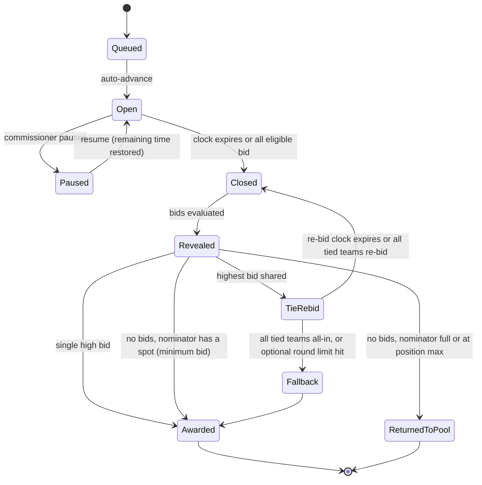
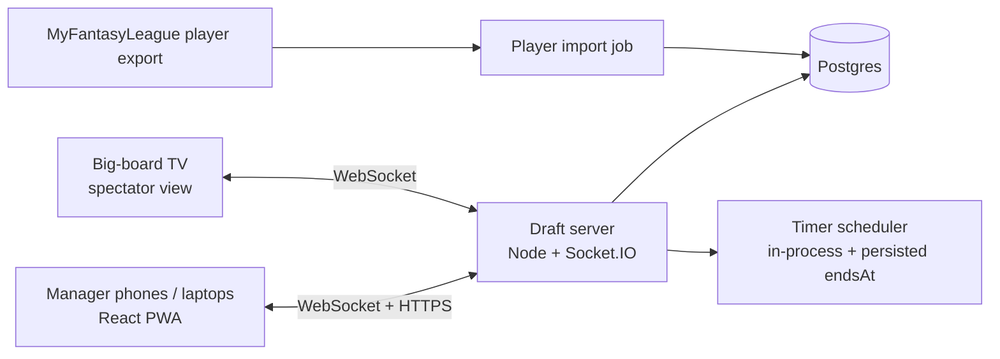

# Closed Auction + Snake Draft App — Tech Spec

Version: Sep 25, 2026. Source of truth for the build. League-specific defaults are marked "your league"; every rule is also a commissioner setting.

## Overview

A real-time web app that replaces the whiteboard: every manager nominates and bids from their own phone or laptop, sealed bids reveal at once when a server-controlled timer expires, and the app handles ties, budgets, rosters and the switch to the snake draft automatically. The goal is to cut a 6–8 hour draft to roughly 3 hours without changing how the league plays.

**Goals**

- Faithfully model the league's rules: sealed-bid auction for the first 8 roster spots, then a snake draft, with the "broke team" rule.
- Make every rule a setting (team count, budget, auction spots, timers, tie handling) so other leagues can use it.
- Keep bids secret until reveal, and make the result impossible to dispute: the server decides timing and winners, and every action is logged.
- Work well on phones in a room together (the league drafts in person), and also for remote managers.

**Time targets (12 teams)**

| Stage | Volume | Target per item | Target total |
| --- | --- | --- | --- |
| Auction nominations | 96 players (12 × 8) | 20 s | ~32 min |
| Sealed bidding + reveal | 96 lots, some ties | 60 s bid + ~18 s reveal | ~2 h 5 min |
| Snake picks | 108 picks (17-man roster) | 45 s max, most faster | ~50 min |

Success = a full 12-team draft finishes in about 3 hours with no manual bookkeeping and no disputes over who bid what.

## Draft rules as the app models them

The draft runs in two phases — a sealed-bid auction until every team has its auction spots filled or is broke, then a snake draft for the rest of the roster — and every number below is a league setting.

**League settings**

| Setting | Default (your league) | Allowed range / options |
| --- | --- | --- |
| Number of teams | 12 | 2–20 |
| Starting budget | $1,000 | $1–$100,000 |
| Auction roster spots | 8 | 0 to total roster size |
| Total roster size | 17 | 1–30 |
| Position limits | QB 2–2, RB 4–5, WR/TE 6–7, K 2–2, DEF 2–2 | Any groups of positions, each with a min and max; or off |
| Minimum bid | $5 | ≥ $0 |
| Bid step (bids must be multiples of) | $1 (any whole-dollar amount at or above the minimum, e.g. $47) | ≥ $1 |
| Minimum raise on a tie re-bid | $5 | ≥ $1 |
| Nominator must bid on own nominee | Off | on / off |
| If nobody bids | Nominator gets the player at the minimum bid; if the nominator's auction spots are already full, the player returns to the pool | award nominator / return to pool |
| Nomination order across auction rounds | Snake: 1 → 12, then 12 → 1 | snake / same order every round |
| Nomination clock | 30 s | off, 10–300 s |
| Bid clock | 60 s | off, 10–600 s |
| Tie re-bid clock | 30 s | off, 10–300 s |
| Close bidding early when everyone has bid | On | on / off |
| Max tie re-bid rounds | Unlimited — keep re-bidding | unlimited, or 1–10 then fallback |
| Tie fallback (only if a limit is set, or every tied team is all-in) | Random draw | random draw, commissioner decides, higher remaining budget, earlier team number |
| Bids shown at reveal | Top 3 (winner + next two) | winner only, top 2–N, or all bids |
| Big-board view | On | on / off |
| Snake pick clock | 60 s | off, 10–600 s |
| On pick-clock expiry | Auto-pick from queue, else best available that fits position limits | auto-pick / skip and let them pick later |
| Broke teams fill auction spots at end of draft | On | on / off |
| Absent manager | Commissioner chooses per situation: pause and wait, or continue and that team simply doesn't bid | No one can ever bid, nominate or pick for another team |

Clock lengths and the reveal setting can be changed mid-draft (see Pausing and changing clocks); everything else locks when the draft starts.

**Phase 1 — Sealed-bid auction**

1. Draft order is set by team number (1–N), assigned randomly or by the commissioner.
2. Nominations snake across rounds: round 1 goes team 1 → 12, round 2 goes 12 → 1, round 3 goes 1 → 12 again, and so on. Each eligible team nominates one available player. Eligible = has an open auction spot and can still afford the minimum bid. Teams with all 8 auction spots filled stop nominating.
3. When all nominations for the round are in, the lots are bid on one at a time, in nomination order.
4. For each lot, every eligible team may submit one sealed bid (they can change it until the clock ends). The nominator is not required to bid. Bids must be at least the minimum bid, a multiple of the bid step, no more than the team's remaining budget, and must not push the team past a position maximum (e.g. a team with 2 QBs can't bid on a QB). Instead of bidding, a team may **Pass**: it locks the team in without a bid so the lot can close early, can be changed to a bid (or back) until the clock ends, and looks exactly like a bid to everyone else until the reveal. A pass is never a bid — if every team passes, the "no bids" rule below applies (the nominator included). Pass is available in the opening sealed round only, not in tie re-bid rounds.
5. When the clock hits zero (or everyone has bid, if early close is on), bids lock and reveal simultaneously, showing the winner plus as many runner-up bids as the reveal setting allows. The highest bid wins; the amount comes off the winner's budget and the player fills one of their auction spots.
6. **Tie:** only the teams tied for the top bid re-bid, and everyone sees the re-bid amounts after each round. Each new bid must beat that team's own previous bid by at least the minimum tie raise ($5) and stay within budget. Only teams still tied at the new top bid continue (re-bids of $250, $250 and $220 leave just the two $250 teams), and this repeats until there is one winner. The fallback only applies if the commissioner sets a round limit, or if every tied team is already all-in and can't raise.
7. **No bids:** by default the nominator gets the player at the minimum bid; if the nominator's auction spots are already full (they filled up earlier in the round), or the award would break their position maximum, the player goes back into the pool. The commissioner can instead choose "always return to pool".
8. Rounds repeat until every team has filled its auction spots or is broke. Broke = remaining budget is below the minimum bid (e.g. $3 left with a $5 minimum).

**Phase 2 — Snake draft**

1. Order runs team 1 → N, then N → 1, repeating (team N picks twice at the turn, as does team 1).
2. Every team makes its normal snake picks for its non-auction roster spots (17 − 8 = 9 rounds in your league).
3. **Broke-team rule:** a team that went broke (couldn't afford the minimum bid) before filling its auction spots still makes all its normal snake picks, then drafts its missing auction spots in extra "make-up" rounds after the regular snake finishes, in snake order among just those teams, continuing the direction the snake ended.
4. The draft ends when every roster is full.

## Roles and core flows

| Role | Can do |
| --- | --- |
| Commissioner | Create league, set rules, invite teams, set draft order, start/pause/resume, timed breaks, change clock lengths mid-draft, undo last result, resolve tie fallback, edit rosters and budgets. Never bids, nominates or picks for another team, and never sees bids before reveal. |
| Manager | Join by invite link, nominate, submit and change sealed bids, make snake picks, keep a watchlist/queue |
| Spectator / "big board" | Read-only live view for a TV or projector: current lot, timer, who has bid, reveals, budgets, rosters |

**Flow 1 — Pre-draft setup (commissioner)**

1. Create league → enter settings (or accept defaults).
2. Share invite link; managers join and claim a team.
3. Assign team numbers (random shuffle button or manual).
4. Load player pool (import from MyFantasyLeague, plus manual add for anyone missing).
5. Run a test "mock round" if wanted, then start the draft.

**Flow 2 — Auction round (everyone)**

1. On the clock: the nominating team's screen shows "Nominate a player" with search; others see who is nominating.
2. Nominations fill a round list in order; once all are in, lot 1 opens.
3. Bid screen: player card, your remaining budget and max bid, a number pad, Submit / Pass / Change. A strip shows which teams are in (never amounts, and a pass looks the same as a bid).
4. Timer expires → bids flip at once on every screen (winner + as many runner-ups as the reveal setting allows), winner highlighted, budgets and rosters update.
5. Tie → tied teams get a re-bid prompt showing their minimum allowed amount; everyone else sees "Tie-break in progress", then every re-bid amount.
6. Next lot; after the last lot, the next nomination round begins (reversed order).

**Flow 3 — Snake phase**

1. Banner announces the switch; draft board shows snake order.
2. Team on the clock picks from the available list or their queue before the pick clock ends.
3. After regular rounds, make-up rounds run for broke teams, then the draft is marked complete.

**Flow 4 — After the draft**

Final rosters, spend per team and a full pick/bid log, exportable as CSV, a shareable results page, and (phase 4) a push to MyFantasyLeague.

## Functional requirements

| ID | Requirement | Priority |
| --- | --- | --- |
| FR-01 | Commissioner creates a league with all settings in the rules table; settings lock when the draft starts, except clock lengths and reveal display | Must |
| FR-02 | Managers join via invite link and claim a team (name, optional avatar); no password beyond a magic link or code | Must |
| FR-03 | Draft order: random shuffle or manual assignment of team numbers | Must |
| FR-04 | Player pool imported from MyFantasyLeague's player export, searchable by name, position, NFL team; manual add/edit | Must |
| FR-05 | Nomination order snakes across auction rounds (1→12, 12→1); only available players; skip teams that are full or broke | Must |
| FR-06 | Sealed bids: one active bid or pass per team per lot, editable until close, bids validated against min bid, bid step, remaining budget and position max; a pass is indistinguishable from a bid before reveal | Must |
| FR-07 | Bid amounts are never sent to any client (commissioner included) before reveal; clients only see submitted/not submitted per team | Must |
| FR-08 | Server-controlled bid clock; bids received after close are rejected | Must |
| FR-09 | Simultaneous reveal of the winner plus the configured number of runner-up bids (default top 3); award, budget and roster updated atomically | Must |
| FR-10 | Tie re-bid loop limited to tied teams, each bid ≥ own previous bid + minimum tie raise; all re-bids revealed to everyone each round; unlimited rounds by default; fallback only when all tied teams are all-in or a limit is set | Must |
| FR-11 | Automatic transition to snake when all teams are full or broke in auction spots | Must |
| FR-12 | Snake order with turn-around picks; pick clock; auto-pick or skip on expiry | Must |
| FR-13 | Broke-team make-up rounds at the end of the snake | Must |
| FR-14 | Commissioner controls: pause/resume (timer freezes, bid entry locks), timed breaks, change clock lengths mid-draft, +15 s, undo last award or pick, edit budget/roster; no acting on behalf of any team | Must |
| FR-15 | Live draft board: rosters, budgets, max bid per team, spots left, lot queue, snake board | Must |
| FR-16 | Reconnect and resume: a refreshed or reconnected client restores full state in < 2 s | Must |
| FR-17 | Audit log of every nomination, bid (amount + server timestamp), reveal, tie round, pick and commissioner action | Must |
| FR-18 | Export results as CSV; shareable read-only results page | Should |
| FR-19 | One ranked queue per manager, built in the lobby or during the draft and private to them; auto-nominate and auto-pick use its top available player first (auto-pick: the first who fits the roster) | Should |
| FR-20 | Sounds/vibration for "you're on the clock" (your nomination, tie re-bid or pick), a 10-second warning while you still haven't acted (bids included), and every reveal (a distinct one if you won); each manager can turn sound and vibration off on their device | Should |
| FR-21 | Big-board spectator mode for a TV | Must |
| FR-22 | Configurable position groups with min/max (your league: QB 2, RB 4–5, WR/TE 6–7, K 2, DEF 2), enforced on bids, picks and auto-picks; a team can't take a player that leaves its remaining minimums unfillable | Must |
| FR-23 | Player projections/ADP shown on the player card | Could |
| FR-24 | Push final rosters and auction prices to MyFantasyLeague (other hosts later) | Should |
| FR-25 | Keeper/pre-assigned players before the draft (not used by your league) | Could |

## Timer and sealed-bid mechanics

The server is the only clock that matters: it stores an absolute end time for each lot, closes bidding itself, and judges every bid by when the server received it.

**Lot state machine**

**Timer rules**

- On open, the server writes `endsAt = now + bidClock` and broadcasts it. Clients show a countdown using a measured server-time offset (sync on connect and every 30 s).
- A server-side scheduled job closes the lot at `endsAt`. Bids are accepted only if the server receives them before `endsAt`; no grace period, and the rejection reason is shown.
- Early close (setting): when every eligible team has submitted a bid or passed, the lot closes after a 3-second "last chance" countdown.
- Pause stores `remainingMs`; resume sets a new `endsAt = now + remainingMs`.
- The commissioner can add 15 s to the current clock.

**Sealed-bid rules**

- A bid is an upsert keyed by (lot, team, tie round); the latest one before close counts. A pass is the same kind of entry with no amount, so bid → pass → bid just replaces it.
- Server validation: team eligible, amount ≥ minimum bid, multiple of the bid step, ≤ remaining budget, within position maximums, and on a tie re-bid, ≥ that team's previous bid + the minimum tie raise.
- Amounts are stored server-side only and never shown to anyone before reveal — including the commissioner, who is usually drafting too. The only pre-reveal broadcast is `{teamId, hasBid: true}`.
- The reveal is a build-up (runner-up bids flipping 1.5 s apart), then the winner, then the details with a 10-second "Up next" countdown — about 18 seconds with the default top-3 reveal (15 s winner only, 20 s all bids); whatever comes next — the next lot, the next nomination turn, a tie re-bid round or the snake — starts its clock only after it. A tie's final result gets the same reveal.
- Reveal sends only what the reveal setting allows (default: winner + next two bids, with team names), in one message, so all screens flip together; hidden losing bids never leave the server. Tie re-bid amounts are always revealed in full. The audit log keeps every bid.
- Award is one database transaction: lot result, winner's budget, roster slot, player marked drafted, audit entry.

**Tie-break detail**

- Only teams sharing the top bid re-bid; the others are out of that lot. After each re-bid round every re-bid amount is revealed to everyone, and only teams still tied at the new top bid continue.
- Each re-bid must be at least the team's previous bid + $5 (minimum tie raise). No round limit by default.
- A tied team that can't raise (all-in) keeps its bid. If another tied team raises, the all-in team loses; if every tied team is all-in, the fallback decides.
- If a tied team doesn't re-bid in time, its previous bid stands.
- The winning price is the winner's final re-bid amount.
- A random draw, if used, is done by the server and logged.

**Pausing and changing clocks**

- **Pause anytime:** during a nomination, an open lot, a tie re-bid or a snake pick. The clock freezes and bid entry locks for everyone; bids already submitted stay hidden and stay in.
- **Timed break:** e.g. "Break for 15 minutes" pauses the draft and shows a countdown on every screen and the big board; the draft does not resume by itself — the commissioner taps Resume, followed by a 10-second "back in" countdown.
- **Resume:** every resume (after a pause or a break) starts a 10-second "back in" countdown on every screen; then the clock picks up from the time that was left. Pausing again during the countdown banks only the real clock time.
- **Edit budget/roster:** the commissioner can adjust a team's budget by ±$ with a reason (never below $0; taking money away waits while that team has a bid or pass in on the lot being decided), take a player off a roster (back to the pool, any auction price refunded), or put an available player into a spot the team has open — an auction spot at a price, or a snake spot that no remaining turn will fill (one opens when a snake pick is removed). Adding never pushes a roster past its size or a position maximum. Roster edits aren't allowed during the make-up round. Undo never targets a commissioner-added player. Every edit is announced on every screen and kept in the draft log.
- **Change clock lengths mid-draft:** anytime from the commissioner console. New lengths apply from the next nomination, lot, tie round or pick; the running clock is unchanged (use +15 s). Every change is logged and announced on screen.

## Data model

Budgets and roster counts are derived from awards and picks rather than stored as loose numbers, so undo is just deleting a row.

| Table | Key fields | Notes |
| --- | --- | --- |
| `league` | id, name, commissioner_user_id, created_at | One per league/season |
| `draft_settings` | league_id, team_count, budget, auction_spots, roster_size, min_bid, bid_step, tie_min_raise, clocks (nomination, bid, tie, pick), early_close, max_tie_rounds (null = unlimited), tie_fallback, no_bid_action, nominator_must_bid, nomination_order (snake/fixed), reveal_top_n, position_groups (json: name, positions, min, max), pick_expiry_action, broke_rule | Locked once the draft starts, except clocks and reveal_top_n |
| `user` | id, display_name, email or phone, auth provider | Email sign-in (code + link); the email is the account |
| `session` | token, user_id, expires_at | 90 days; big-board tokens (`spec_…`) are watch-only and last 2 days |
| `login_code` | email, code_hash, link_hash, next, attempts, expires_at, used_at | One sign-in email: 6-digit code and link, 15 minutes, single use, 5 wrong tries; 5 emails per address per 15 minutes |
| `team` | id, league_id, user_id, name, draft_number | draft_number = 1..N |
| `player` | id, mfl_id, name, position, nfl_team, bye_week, status, custom | Imported pool + manual adds |
| `draft` | id, league_id, phase (setup/auction/snake/makeup/complete), auction_round, current_lot_id, current_pick_no, paused, break_ends_at, version | `version` increments on every change for client sync |
| `lot` | id, draft_id, round, order_in_round, player_id, nominated_by_team_id, state, tie_round, ends_at, remaining_ms, winner_team_id, price | One nominated player up for bid |
| `bid` | id, lot_id, team_id, tie_round, amount, received_at, superseded | Latest non-superseded row per team per tie_round counts |
| `pick` | id, draft_id, pick_no, round, team_id, player_id, source (auction/snake/makeup/auto), price, made_at | Auction awards also write a pick for one unified roster view |
| `team_queue` | team_id, player_ids (ordered json array), updated_at | One ranked queue per team; taken players stay in the list but are skipped. Never sent to anyone but the team's manager |
| (engine state) | commish_log (every commissioner edit: budget, remove, assign, void, unavailable, available), resume_hold_until | Stored with the draft's engine bookkeeping; budget adjustments count toward remaining budget |
| `audit_event` | id, draft_id, seq, actor_user_id, type, payload_json, created_at | Append-only; powers undo, replay and disputes |

**Derived values:** remaining budget = budget − sum(auction prices); auction spots left; max bid = remaining budget (no forced reserve); broke = remaining budget below the minimum bid and auction spots left > 0.

**Key constraints:** a player appears in at most one pick per draft (unique index); a team can't exceed roster size or position maximums; one open lot per draft at a time.

## Architecture and tech stack

Recommended: one TypeScript codebase — a React web app installable on phones (PWA), a Node server that owns the draft state and pushes updates over WebSockets, and Postgres for durable storage.

| Layer | Recommendation | Why | Alternative |
| --- | --- | --- | --- |
| Front end | React + Vite, Tailwind, installable PWA | Fast on phones, no app-store release | React Native later |
| Real-time | Socket.IO rooms, one room per draft | Built-in reconnect, acknowledgements | Supabase Realtime, Ably, Pusher |
| Server | Node.js + Fastify, one authoritative draft engine per draft | All rule logic in one place; easy to test | — |
| Database | Postgres (Drizzle or Prisma) | Transactions for awards; unique constraints | Supabase |
| Auth | Email with a 6-digit code and a magic link (the code covers phones where the link opens in another browser); league invite code to claim a team | Friends shouldn't need passwords | Google sign-in |
| Player data | MyFantasyLeague player export + CSV upload | IDs match the league for the push later | CSV only |
| Hosting | Render, Railway or Fly.io + managed Postgres | Simple deploys, WebSocket support | Any VPS |
| Testing | Vitest for the rules engine, Playwright for multi-browser draft simulations | Rules must be provably right | — |

**Design principles**

- **Server-authoritative engine:** clients send intents (nominate, bid, pick); the server validates, updates state, persists, then broadcasts. Clients never decide outcomes.
- **Rules engine as pure functions:** `(state, action) → newState + events`, independent of the network and database, so every rule is unit-tested and a draft can be replayed from the audit log. Time and randomness are injected, never read directly.
- **Crash-safe:** each state change is written to Postgres before it is broadcast; on restart the server reloads the draft, re-arms timers from stored `endsAt`, and clients reconnect.
- **Mobile-first UI**, with larger layouts for laptops and the TV board.

## API and real-time events

Every server message carries the draft `version` so a client that misses a message re-syncs.

**HTTPS (setup and history)**

| Method | Path | Purpose |
| --- | --- | --- |
| POST | /leagues | Create league + settings |
| PATCH | /leagues/:id/settings | Edit settings (before draft start) |
| POST | /leagues/:id/invites | Create invite link |
| POST | /leagues/:id/teams/claim | Manager claims a team |
| PUT | /leagues/:id/draft-order | Set or shuffle team numbers |
| GET | /players?search=&pos= | Search player pool |
| POST | /leagues/:id/players | Manual player add / CSV upload |
| GET | /drafts/:id/state | Full snapshot (connect/reconnect) |
| GET | /drafts/:id/log | Audit log |
| GET | /drafts/:id/export.csv | Results export: one row per pick (stage, team, player, price, note, revealed runner-up bids), built from the bid-scrubbed snapshot; league members only |

**Client → server (WebSocket intents)**

| Event | Payload | Who |
| --- | --- | --- |
| `nominate` | playerId | Team on the clock |
| `bid:submit` | lotId, amount | Eligible team |
| `bid:pass` | lotId | Eligible team (opening round only) |
| `pick:make` | playerId | Team on the clock |
| `queue:update` | playerIds[] (the whole ranked list, max 200) | Any manager, own team only; allowed while paused. Before the draft starts, `PUT /leagues/:id/queue` does the same |
| `admin:start` / `admin:pause` / `admin:resume` | — | Commissioner |
| `admin:break` | minutes | Commissioner |
| `admin:undo` | — | Commissioner |
| `admin:addTime` | seconds | Commissioner |
| `admin:setClocks` | nomination, bid, tie, pick seconds | Commissioner |
| `admin:resolveTie` | lotId, teamId | Commissioner (only if fallback = commissioner) |
| `admin:voidLot` | lotId (open or in a tie re-bid) | Commissioner |
| `admin:markPlayerUnavailable` / `admin:markPlayerAvailable` | playerId | Commissioner |
| `admin:adjustBudget` | teamId, amount (±whole dollars), reason | Commissioner |
| `admin:removePick` | pickId | Commissioner |
| `admin:assignPlayer` | teamId, playerId, slot (auction/snake), price (auction spot) | Commissioner |

Every intent gets an acknowledgement: `ok` or an error code (`BID_TOO_LOW`, `OVER_BUDGET`, `LOT_CLOSED`, `NOT_ELIGIBLE`, `POSITION_LIMIT`, `NOT_YOUR_TURN`, `PLAYER_TAKEN`, `DRAFT_PAUSED`).

**Server → clients (broadcasts)**

| Event | Payload | Notes |
| --- | --- | --- |
| `state:snapshot` | full public state | On connect / version gap |
| `nomination:turn` | teamId, endsAt | |
| `nomination:made` | lot summary | |
| `lot:open` | lotId, player, eligibleTeamIds, endsAt | |
| `lot:bidStatus` | teamId, hasBid | Never includes amount |
| `lot:closing` | endsAt (3-s last chance) | Early close only |
| `lot:reveal` | winner + top-N bids per reveal setting; tie re-bids in full; number of passes (never who) | Sent once, to everyone |
| `lot:tie` | tiedTeamIds, minBidPerTeam, tieRound, endsAt | |
| `lot:awarded` | winner, price, updated budget and roster | |
| `lot:returned` | playerId | No-bid return to pool |
| `draft:phase` | auction / snake / makeup / complete | |
| `pick:turn` | teamId, pickNo, endsAt | |
| `pick:made` | teamId, player, source | |
| `draft:paused` / `draft:resumed` | remainingMs, breakEndsAt / endsAt | |
| `settings:clocks` | new clock lengths | Mid-draft change |
| `you:private` | your own current bid, queue | Only to that manager's sockets. Snapshots carry `myQueue` for the viewer only; room-wide snapshots carry no queue |

## Screens

| Screen | Who | Key elements |
| --- | --- | --- |
| League setup | Commissioner | Settings form with defaults pre-filled, rule summary preview |
| Lobby | Everyone | Teams joined / ready, draft order, invite link, start button (commissioner) |
| Nominate | Team on the clock | Player search + filters, your queue (★), nomination clock; others see "Team 4 is nominating…" |
| Round queue | Everyone | This round's nominated players in bidding order, which lot is live |
| Bid | Eligible managers | Player card, countdown ring, your budget / max bid / spots left, number pad, Submit / Pass / Change, "8 of 12 are in" strip; disabled with reason if not eligible |
| Reveal | Everyone | Winner and configured runner-up bids flip together, high to low, winner banner; tie prompt for tied teams |
| Snake board | Everyone | Grid of rounds × teams, on-the-clock highlight, pick clock, available players + your queue |
| Rosters & budgets | Everyone | Per-team roster by position, money left, max bid, auction spots left, broke flag |
| Commissioner console | Commissioner | Pause/resume, timed break, add time, change clocks, undo, resolve tie, edit budget/roster, connection status per team |

The big board is a TV-sized view combining the live lot, timer, bid-status strip, reveal, break countdown and team budgets.

## Edge cases and failure handling

Each case needs a unit test in the rules engine.

| Situation | Behavior |
| --- | --- |
| Nominator's clock runs out | Auto-nominate the top available player in their queue, else highest-ranked available; or skip (setting) |
| Team fills its auction spots mid-round | Excluded from bidding on remaining lots and from future nominations; its already-queued nominee still runs |
| Team can't afford the minimum bid before filling auction spots | Marked broke; skips nominations and bids; gets make-up picks at the end of the snake |
| Winning bid leaves a team below the minimum bid with spots left | Allowed (no reserve rule); team becomes broke |
| All tied teams are all-in and can't raise | Tie fallback decides (default: random draw) |
| Only one team eligible for a lot | Lot runs normally; that team may bid the minimum or more |
| Round has fewer lots than teams | Normal; next round follows the snake nomination order, skipping ineligible teams |
| Auction ends mid-round (everyone full or broke) | Remaining queued lots are cancelled; players return to the pool |
| Final rounds get small (e.g. 2 teams left needing players) | Rounds continue with just those teams |
| No bids, nominator already full or at position max | Player returns to the pool and can be nominated again |
| Team nominates a player at a position it's maxed on | Allowed; it just can't bid on him |
| Two teams nominate the same player in a round | Impossible: a nominated player leaves the available list |
| Team at a position maximum | Not eligible on that lot; bid pad disabled with the reason |
| A pick would make remaining position minimums impossible | Rejected with the reason; auto-pick only chooses players that keep the roster valid |
| Broke team hasn't met position minimums by make-up rounds | Make-up picks restricted to positions still needed |
| Manager disconnects during a lot | Submitted bid stands; commissioner sees them offline and can pause to wait; no one can bid for them |
| Manager's phone clock is wrong | Irrelevant — countdown uses server offset, server decides |
| Server restarts mid-lot | State reloads from Postgres, timer re-armed from stored `endsAt`; if it passed during downtime, the lot is extended by the tie re-bid clock and everyone is notified |
| Two tabs open for the same team | Both stay in sync; latest bid wins |
| Commissioner undoes an award | Only the most recent award/pick; current lot is paused, pick removed, budget restored, player back in the pool; logged |
| Player nominated who's already taken | Rejected (`PLAYER_TAKEN`) by a unique constraint, not just UI |
| Late-breaking injury during the draft | Commissioner can mark a player unavailable (and available again); a lot being bid on or in a tie re-bid can be voided — nobody gets the player, no bid is revealed, and the player can be re-nominated unless marked unavailable. Everyone sees a notice |

## Non-functional requirements

| Area | Requirement |
| --- | --- |
| Latency | Bid acknowledgement < 300 ms; reveal reaches all clients within 500 ms of each other |
| Clock accuracy | All screens within ±250 ms of the server countdown |
| Reliability | No lost state on server restart; auto-reconnect with full re-sync < 2 s |
| Capacity | 20 managers + spectators per draft |
| Fairness & secrecy | Bid amounts never leave the server before reveal (test by inspecting every outgoing message) |
| Auditability | Every action logged with server timestamp; full replay possible |
| Security | HTTPS/WSS only; team actions tied to the authenticated user; commissioner actions role-checked; rate-limit intents |
| Devices | Latest iOS Safari and Android Chrome, desktop browsers; usable at 360 px wide |
| Accessibility | Large tap targets, color not the only signal, screen-reader labels on timer and bids |
| Cost | Under ~$20/month hosting for a single league |

## Pushing results to MyFantasyLeague (phase 4)

MFL has a developer API with import requests that write league data (https://api.myfantasyleague.com/2023/api_info), and FanDraft already exports regular and auction drafts to MFL once the league is set to "3rd Party Draft" (https://help.fandraft.com/article/65-exporting-draft-results-to-myfantasyleague-com). MFL has no simple CSV roster upload.

- **Player IDs:** import the player pool from MFL's player export from day one so every drafted player carries its MFL ID.
- **Auth:** MFL import requests need the commissioner's own MFL login; ask once at export time, don't store the password.
- **What gets pushed:** each team's roster, auction prices as salaries if tracked, and snake picks in order.
- **Fallback:** printable/CSV results sheet by team.
- **Risk:** verify current MFL API rules against a throwaway league before draft day.

## Build phases

| Phase | Scope | Done when |
| --- | --- | --- |
| 1. Rules engine | Pure TypeScript engine: auction, snake nomination order, ties, no-bid rule, broke rule, position limits, snake, make-up rounds, pause, undo; full unit tests | A scripted 12-team draft replays correctly; every edge case passes |
| 2. Server + storage | Postgres schema, Socket.IO server, timers, persistence, reconnect | Engine runs live; restart mid-lot loses nothing |
| 3. Core UI (MVP) | Setup, lobby, nominate, bid, reveal, snake board, rosters, commissioner console, big board | Friends complete a mock draft on phones |
| 4. Polish | Watchlist/queue, auto-pick, sounds, CSV export, MFL player import and push-to-MFL | 12-team mock draft finishes in ~3 h with no manual fixes |
| 5. Nice-to-haves | Projections/ADP, keepers, other hosts (Sleeper, ESPN, Yahoo) | As wanted |

Before the real draft, run one full mock draft with the league.
